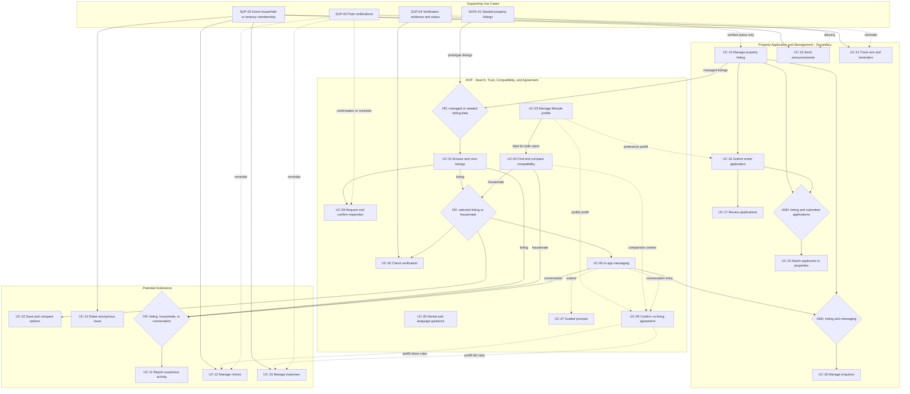

# Use Case Dependency Analysis

## Dependency Rules

- **Required** means the dependent use case cannot proceed without the prerequisite.
- **Data** means the dependent use case needs data created or maintained by the prerequisite.
- **Context (OR)** means any one of the listed contexts is enough.
- **Extend / Optional** means the relationship adds support but is not required for the main success path.

## Dependency Table

| Dependent Use Case | Depends On | Type | Reason |
|---|---|---|---|
| UC-01 Browse and view property listings | UC-15 Manage property listing **OR** DATA-01 Seeded property listings | Required data (OR) | At least one published listing must exist before a student can browse it. |
| UC-02 Check verification status | SUP-04 Verification evidence and status | Required data | The system needs a stored status before it can display pending, verified, or rejected. |
| UC-02 Check verification status | UC-01 listing context **OR** UC-04 housemate context | Required context (OR) | The user must select the listing, landlord, or housemate whose status will be checked. |
| UC-04 Find and compare housemate compatibility | UC-03 Lifestyle profiles | Required data | The system needs enough preference data for both users before it can compare them. |
| UC-06 Send in-app messages | UC-01 listing context **OR** UC-04 housemate context | Required context (OR) | A conversation needs a valid landlord, property, or housemate recipient. |
| UC-07 Use guided message prompts | UC-06 In-app messaging | Extend | Guided prompts are an optional action inside a conversation. |
| UC-08 Request and confirm a property inspection | UC-01 Property listing | Required | The request needs a selected property; `UC-08` also handles available times and property-manager confirmation. |
| UC-08 Request and confirm a property inspection | SUP-03 Push notifications | Optional | Push notifications deliver the confirmation, change, or reminder outside the active app. |
| UC-09 Create, review, and confirm a co-living agreement | SUP-01 access for two or more identified participants | Required | Every participant must be identified and must review or accept the agreement for themselves. |
| UC-09 Create, review, and confirm a co-living agreement | UC-03 profile, UC-04 comparison, or UC-06 conversation | Optional context / prefill | Profile data, comparison results, or a conversation may start or prefill an agreement, but none is mandatory. |
| UC-10 Save and compare options | UC-01 listing context **OR** UC-04 housemate context | Required context (OR) | The saved option must be a listing or housemate result. |
| UC-11 Report suspicious activity | UC-01 listing **OR** UC-04 housemate **OR** UC-06 conversation | Required context (OR) | A report must identify its target. |
| UC-12 Manage household chores | SUP-02 Active household membership | Required | Only authorised members of the household can view or change its chores. |
| UC-12 Manage household chores | UC-09 Co-living agreement | Optional data | Accepted chore expectations may prefill the chore setup. |
| UC-12 Manage household chores | SUP-03 Push notifications | Optional | Push notifications can remind residents about assigned or overdue chores. |
| UC-13 Manage shared expenses | SUP-02 Active household membership | Required | Expenses and payment status must belong to an authorised household. |
| UC-13 Manage shared expenses | UC-09 Co-living agreement | Optional data | Accepted bill rules may prefill expense settings. |
| UC-13 Manage shared expenses | SUP-03 Push notifications | Optional | Push notifications can remind residents about due or overdue payments. |
| UC-14 Raise an anonymous household issue | SUP-02 Active household membership | Required | The issue must belong to the reporter's household while hiding the reporter's name from other residents. |
| UC-15 Create and manage a property listing | SUP-04 Verification evidence and status | Conditional | Verification is required only before a verified badge is shown; an unverified or pending listing may still be saved unless a verified-only policy is adopted. |
| UC-16 Complete and submit a rental application | UC-15 Active property listing | Required data | The application must be linked to a property that accepts applications. |
| UC-16 Complete and submit a rental application | UC-03 Lifestyle profile | Optional data | Existing lifestyle preferences may prefill matching fields, but the application still collects its own identity, contact, and rental details. |
| UC-17 Review rental applications | UC-16 Submitted application | Required | The property manager needs a complete submitted application before recording a review. |
| UC-18 Manage property enquiries | UC-15 Property listing **AND** UC-06 Messaging | Required data / shared capability (AND) | A listing-related enquiry needs both a property context and the in-app messaging capability. |
| UC-19 Send tenant announcements | SUP-02 Active tenancy membership | Required | The system needs a confirmed current-tenant audience; selecting an applicant is not enough. |
| UC-19 Send tenant announcements | SUP-03 Push notifications | Optional | Push notifications deliver the announcement outside the active app. |
| UC-20 Match applicants to properties | UC-15 Active property listing **AND** UC-16 Submitted applications | Required data (AND) | Matching needs property requirements and submitted applicant data; application review remains a separate workflow. |
| UC-21 Track rent and send reminders | SUP-02 Active tenancy membership | Required | Rent tracking needs a confirmed tenant-property relationship. |
| UC-21 Track rent and send reminders | SUP-03 Push notifications | Optional | Push notifications deliver due-date and overdue reminders outside the active app. |

## Dependency Graph

