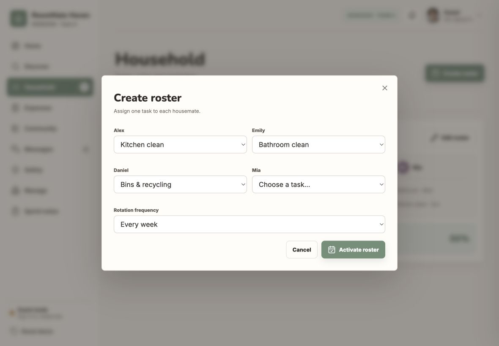
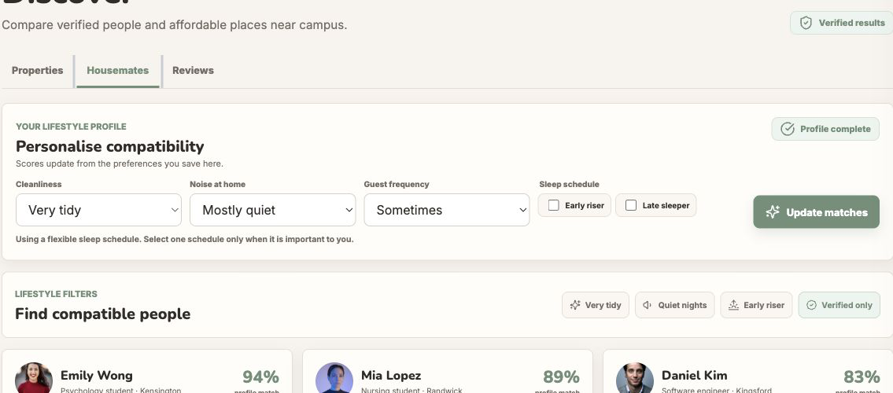
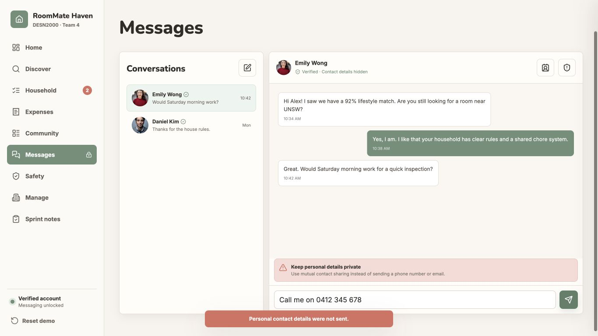
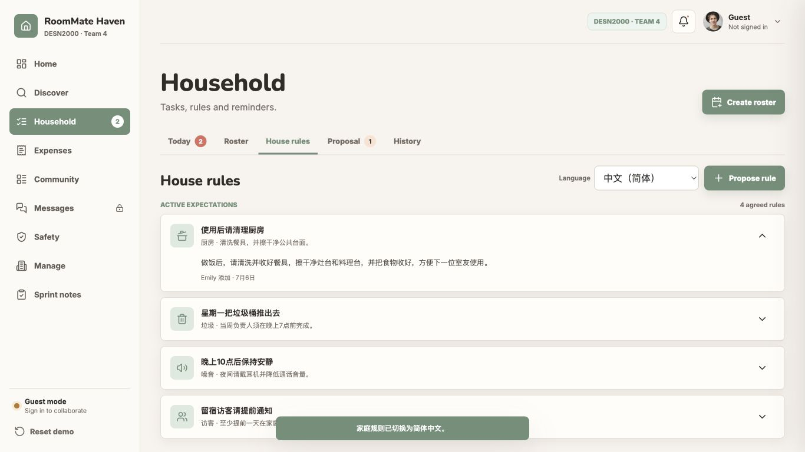
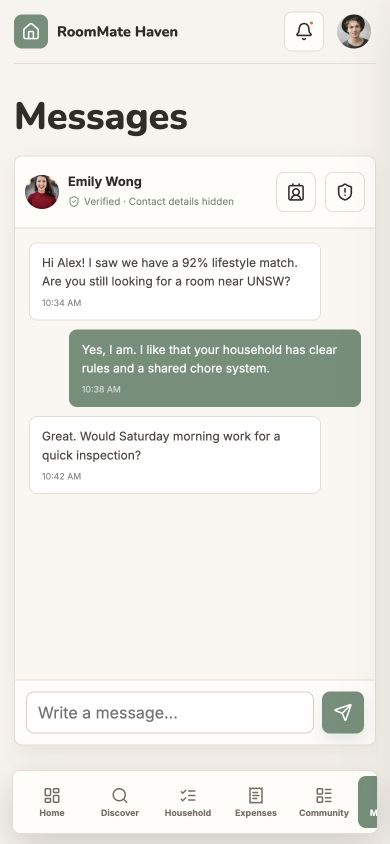
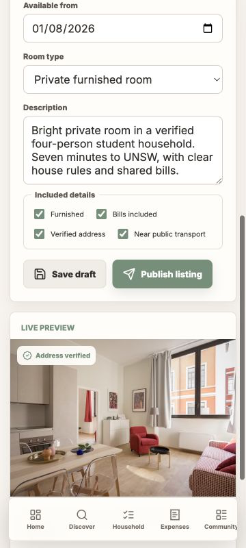
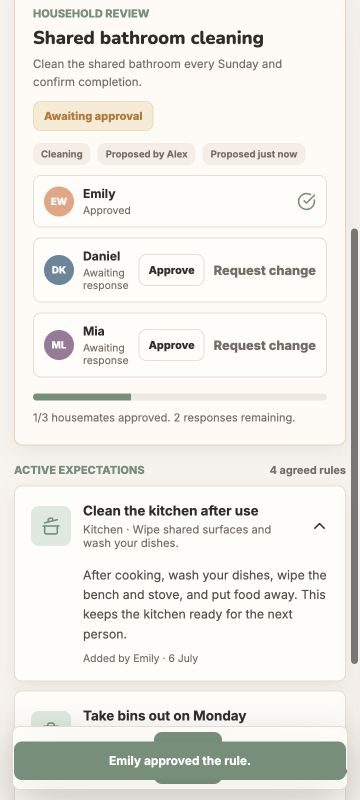

# Iteration 1 Participant Evidence

## User A T5 Create roster dialog

At 1180 by 820 pixels, keyboard focus left the open dialog and Escape did not
close it. Focus was not restored to the trigger, so User A needed help.

## User B T2 Discover tabs

At 1440 by 900 pixels, the tabs ignored the arrow keys and showed selection
mainly through green text and a thin underline. User B used a pointer to finish.

## User C T4 Contact sharing

At 1366 by 768 pixels, the warning did not clarify how to use the separate
contact sharing icon. User C paused for more than 30 seconds and needed one hint.

## User C T5 Language selection

At 1366 by 768 pixels, selecting Simplified Chinese translated the rules but
left the surrounding interface in English. User C found the setting incomplete.

## User D T4 Mobile messages

At 390 by 844 pixels, the screen hid the conversation list and New message
control without a replacement. User D could not select Daniel or start a chat.

## User E T5 Save draft

At 360 by 800 pixels, Save draft produced no visible response. User E selected
it twice and assumed it had failed.

## User E T5 Approval status

At 360 by 800 pixels, the approval count appeared apart from the activation
condition. User E needed clarification and did not finish independently.
