# RoomMate Haven Playwright QA Findings

## Test scope

- Application: `roommate-haven`
- Test date: 27 July 2026
- Browser: Chromium/Chrome controlled through Playwright
- Desktop viewport: 1470 × 726
- Mobile viewport: 390 × 844
- Evidence location: `part3/tests/`
- Repository files were not modified during the test; only this report and the `QA-*` evidence screenshots were added.

## Summary

| Category | Findings |
|---|---:|
| Functional and test infrastructure | 8 |
| Accessibility | 9 |
| UI/responsive layout | 1 |
| Total independent findings | 18 |

The property search recovery flow, expense calculation, login, phone verification, safe message delivery and contact-detail blocking continued to work. The findings below focus on broken or incomplete behaviour discovered during the wider Playwright review.

---

## QA-01 — Playwright server port mismatch

**Category:** Functional / test infrastructure  
**Priority:** P1

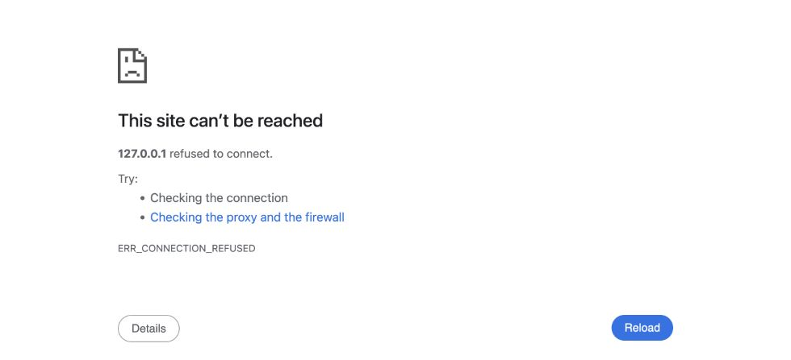

**Reproduction**

1. Run `npm run test:e2e` without manually setting `PORT`.
2. Playwright executes `npm start`.
3. Playwright waits for `http://127.0.0.1:4173`.

**Observed evidence**

- `playwright.config.cjs` uses port `4173` for both `baseURL` and `webServer.url`.
- `server.js` defaults to port `8080`.
- The test command timed out after 60 seconds.
- With the default start configuration active, a cache-busted request to port `4173` returned `ERR_CONNECTION_REFUSED`, as shown in the screenshot.
- Existing E2E tests passed only after manually starting the server with `PORT=4173 npm start`.

**Impact**

Fresh local environments and CI cannot run the E2E suite using the documented command.

**Suggested fix**

Change `webServer.command` to `PORT=4173 npm start`, or make the server and Playwright configuration share one port.

**Related source**

- [`playwright.config.cjs`](../../roommate-haven/playwright.config.cjs#L8)
- [`server.js`](../../roommate-haven/server.js#L5)

---

## QA-02 — Modal focus escapes into an aria-hidden drawer

**Category:** Accessibility  
**Priority:** P1

**Reproduction**

1. Open the login modal.
2. Focus its first close control.
3. Press `Shift+Tab`.

**Observed evidence**

- The login modal remained open.
- `document.activeElement` became `#mark-read`, the “Mark all as read” button.
- That button is outside the modal and inside the notification drawer while the drawer has `aria-hidden="true"`.
- The screenshot shows the modal still blocking the UI, but no focus indicator is visible inside it because focus is behind the modal.

**Impact**

Keyboard and screen-reader users can interact with hidden background controls and lose their position inside a modal dialog.

**Suggested fix**

Trap focus inside the active modal, make background surfaces inert, and restore focus to the opening control when the modal closes.

**Related source**

- [`app.js`](../../roommate-haven/app.js#L170)
- [`index.html`](../../roommate-haven/index.html#L615)

---

## QA-03 — Escape does not close modal dialogs

**Category:** Accessibility  
**Priority:** P2

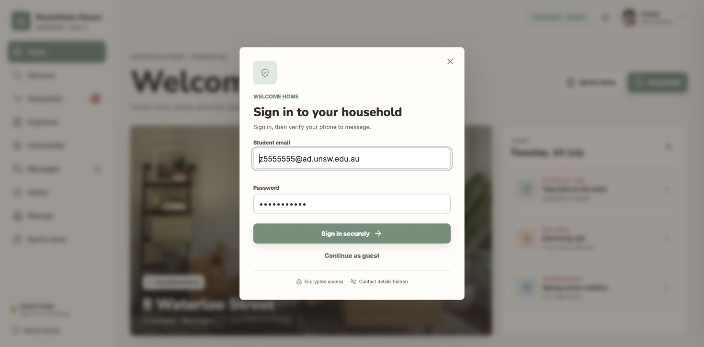

**Reproduction**

1. Open the login modal.
2. Focus the student email field.
3. Press `Escape`.

**Observed evidence**

- The modal retained its `open` class.
- Its computed display remained `flex`.
- Focus remained on `#login-email`.

**Impact**

Keyboard users cannot use the standard Escape-key convention to dismiss modal dialogs.

**Suggested fix**

Add a document-level Escape handler that closes the top-most dialog and restores focus.

**Related source**

- [`app.js`](../../roommate-haven/app.js#L170)

---

## QA-04 — Skip link changes the hash but does not move focus

**Category:** Accessibility  
**Priority:** P2

**Reproduction**

1. Focus “Skip to content”.
2. Press `Enter`.

**Observed evidence**

- The URL changed to `#main-content`.
- The active element became `BODY`, not `#main-content`.
- `#main-content` has no `tabindex`.

**Impact**

Keyboard and screen-reader users are not reliably moved past repeated navigation controls.

**Suggested fix**

Add `tabindex="-1"` to `#main-content` and explicitly focus it when the skip link is activated.

**Related source**

- [`index.html`](../../roommate-haven/index.html#L18)

---

## QA-05 — Notification drawer does not manage focus or background access

**Category:** Accessibility  
**Priority:** P1

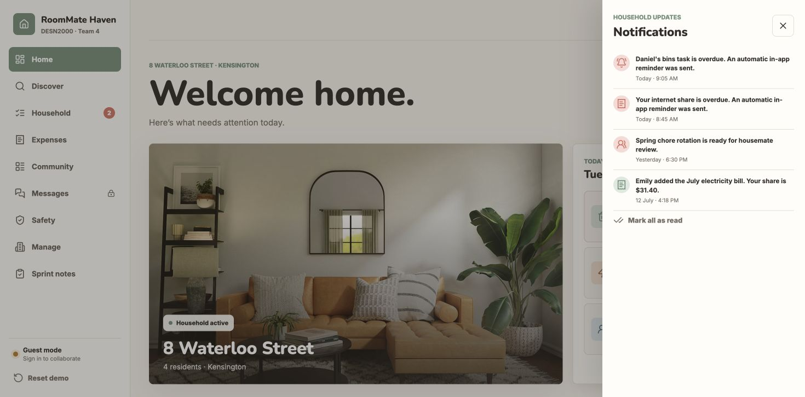

**Reproduction**

1. Activate the Notifications button.
2. Inspect the focused element and the accessibility state of the page.

**Observed evidence**

- The drawer opened and changed to `aria-hidden="false"`.
- Focus remained on `#notification-button`, outside the drawer.
- The drawer has no dialog role.
- `#main-content` was neither inert nor `aria-hidden`.

**Impact**

Screen-reader and keyboard users are not informed that a modal-like surface opened and can continue moving through obscured background content.

**Suggested fix**

Use dialog semantics, move focus to the drawer heading or close button, trap focus while open, make the background inert, and restore focus on close.

**Related source**

- [`index.html`](../../roommate-haven/index.html#L615)
- [`app.js`](../../roommate-haven/app.js#L1177)

---

## QA-06 — Contact-detail warning is not announced

**Category:** Accessibility  
**Priority:** P2

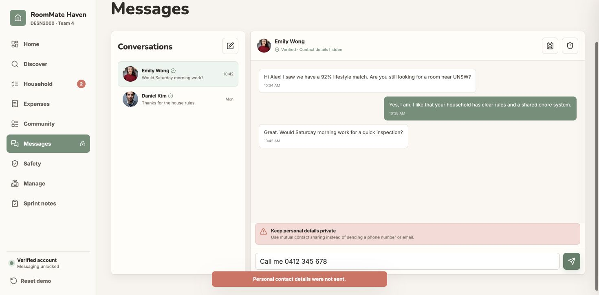

**Reproduction**

1. Unlock Messages.
2. Enter `Call me 0412 345 678`.
3. Send the message.

**Observed evidence**

- The message was correctly blocked.
- The visible warning has neither `role="alert"` nor `aria-live`.
- The warning appears after the chat thread and may not be announced when its `hidden` state changes.

**Impact**

Screen-reader users may not know why their message was not sent.

**Suggested fix**

Add `role="alert"` or an appropriate assertive/polite live region, and associate the warning with the message input using `aria-describedby`.

**Related source**

- [`index.html`](../../roommate-haven/index.html#L430)
- [`app.js`](../../roommate-haven/app.js#L1128)

---

## QA-07 — “New message” button has no effect

**Category:** Functional  
**Priority:** P1

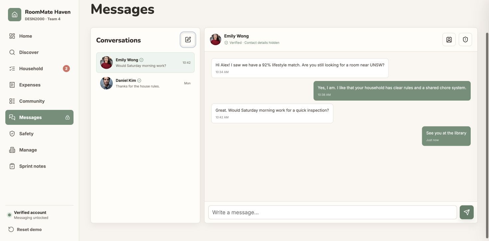

**Reproduction**

1. Open Messages on desktop.
2. Focus the pencil icon labelled “New message”.
3. Press `Enter`.

**Observed evidence**

- The active conversation remained Emily Wong.
- No modal, composer, recipient picker or navigation appeared.
- The URL remained `#messages`.
- The screenshot preserves focus on the activated button while the page remains unchanged.

**Impact**

The interface advertises an action that users cannot complete.

**Suggested fix**

Implement a recipient picker/new-conversation flow, or remove/disable the button with explanatory text until supported.

**Related source**

- [`index.html`](../../roommate-haven/index.html#L423)

---

## QA-08 — Mobile users cannot switch conversations

**Category:** Functional / UI  
**Priority:** P1

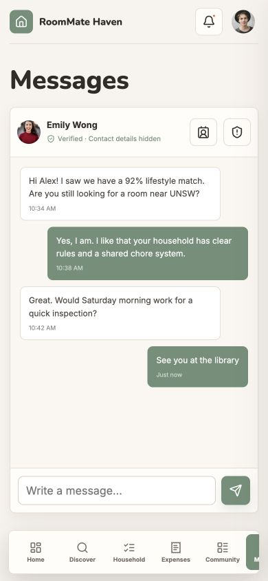

**Reproduction**

1. Set the viewport to 390 × 844.
2. Open Messages after verification.

**Observed evidence**

- `.conversation-list` has `display: none`.
- There are zero visible `[data-thread]` controls.
- The “New message” control is also hidden with the conversation list.
- Only the currently active Emily Wong conversation is available.

**Impact**

Mobile users cannot open the Daniel Kim conversation or start a different conversation.

**Suggested fix**

Replace the hidden desktop sidebar with a mobile conversation list, back button, dropdown or dedicated conversation-index screen.

**Related source**

- [`index.html`](../../roommate-haven/index.html#L421)
- [`app.css`](../../roommate-haven/app.css#L801)

---

## QA-09 — Mobile navigation hides destinations without a clear cue

**Category:** UI / responsive layout  
**Priority:** P2

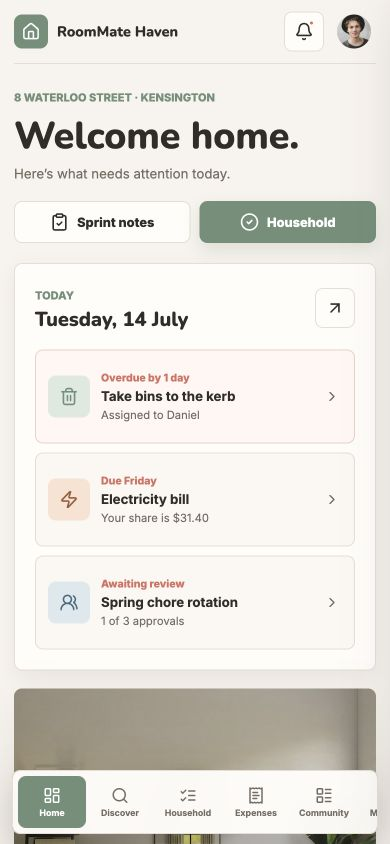

**Reproduction**

1. Set the viewport to 390 × 844.
2. Open Home and leave the bottom navigation at its initial scroll position.

**Observed evidence**

- Navigation client width: `364px`.
- Navigation scroll width: `554px`.
- The Manage button occupied `x=494–562`, beyond the navigation’s right edge at `x=378`.
- The screenshot shows only a clipped fragment of the next destination.

**Impact**

Safety and Manage are initially hidden, and the interface does not clearly communicate that the fixed navigation bar scrolls horizontally.

**Suggested fix**

Reduce the number of primary destinations, use a “More” destination, or add a clearly visible scroll/overflow affordance.

**Related source**

- [`index.html`](../../roommate-haven/index.html#L604)
- [`app.css`](../../roommate-haven/app.css#L740)

---

## QA-10 — “Save draft” does not save or provide feedback

**Category:** Functional  
**Priority:** P1

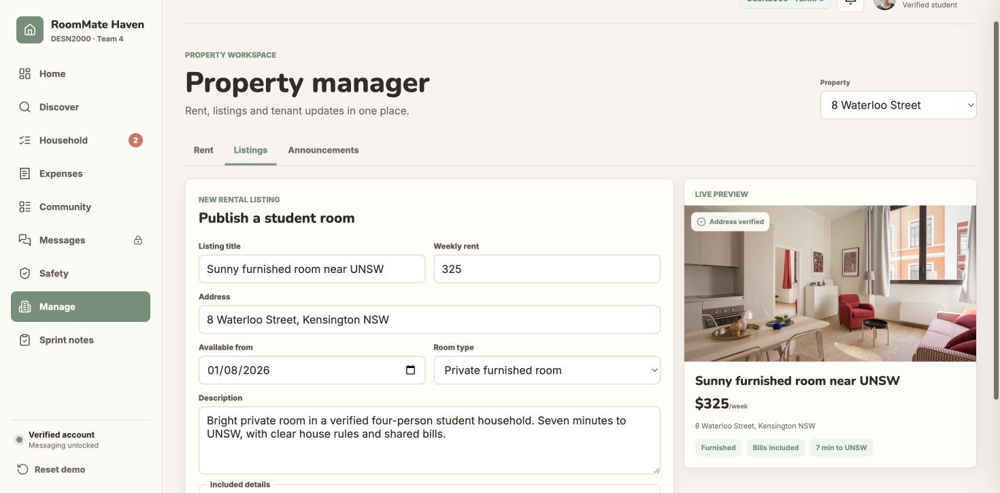

**Reproduction**

1. Open Manage → Listings.
2. Focus “Save draft”.
3. Press `Enter`.

**Observed evidence**

- The page remained on `#manage/listings`.
- No toast, saved state, timestamp or other confirmation appeared.
- The focused button is visible in the screenshot, but the form remains unchanged.

**Impact**

Property managers can reasonably believe a draft was saved when no saving occurs.

**Suggested fix**

Persist the draft and expose a success state, or remove the button until draft storage exists.

**Related source**

- [`index.html`](../../roommate-haven/index.html#L513)

---

## QA-11 — Tablist semantics and keyboard behaviour are incomplete

**Category:** Accessibility  
**Priority:** P2

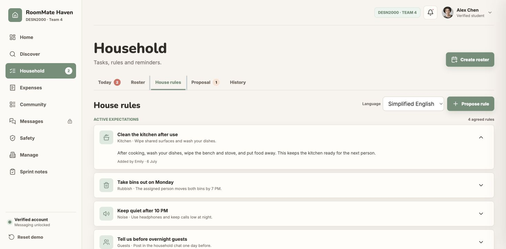

**Reproduction**

1. Open Household.
2. Activate and focus “House rules”.
3. Press `ArrowRight`.

**Observed evidence**

- Focus and the active pane remained on “House rules”.
- Tab buttons have no `role="tab"`.
- The active button has no `aria-selected`.
- No tab button references a controlled panel.

**Impact**

The component announces itself as a tablist but does not provide the expected ARIA tab pattern or arrow-key navigation.

**Suggested fix**

Implement `role="tab"`, `aria-selected`, `aria-controls`, `role="tabpanel"`, roving `tabindex`, and Left/Right arrow handling.

**Related source**

- [`index.html`](../../roommate-haven/index.html#L237)
- [`app.js`](../../roommate-haven/app.js#L200)

---

## QA-12 — Chinese content retains English language metadata

**Category:** Accessibility  
**Priority:** P2

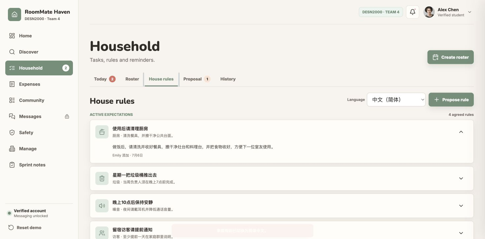

**Reproduction**

1. Open Household → House rules.
2. Select `中文（简体）`.

**Observed evidence**

- Visible content changed to Chinese.
- `<html lang>` remained `en`.
- `#rule-list` had no `lang` attribute.

**Impact**

Screen readers may pronounce Chinese text using English pronunciation rules.

**Suggested fix**

Set `lang="zh-CN"` on the translated rule region, or update the document language when the whole interface changes language.

**Related source**

- [`index.html`](../../roommate-haven/index.html#L273)
- [`app.js`](../../roommate-haven/app.js#L933)

---

## QA-13 — Roster validation errors are not programmatically associated

**Category:** Accessibility  
**Priority:** P2

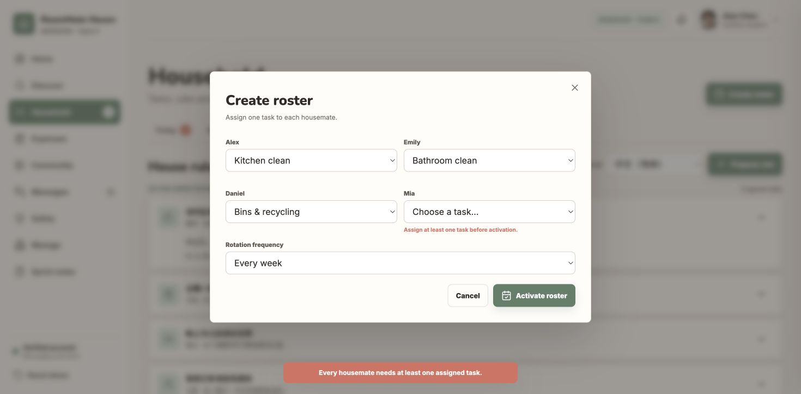

**Reproduction**

1. Open Create roster.
2. Leave Mia on “Choose a task…”.
3. Activate “Activate roster”.

**Observed evidence**

- The visible error says “Assign at least one task before activation.”
- The Mia select has no `aria-invalid`.
- It has no `aria-describedby` linking it to the error.
- Focus remains on the submit button instead of moving to the invalid field.

**Impact**

Screen-reader users may not know which field failed or hear the new error message.

**Suggested fix**

Give each error an ID, set `aria-invalid="true"` and `aria-describedby`, use a live summary if appropriate, and focus the first invalid field.

**Related source**

- [`index.html`](../../roommate-haven/index.html#L639)
- [`app.js`](../../roommate-haven/app.js#L916)

---

## QA-14 — Primary controls and small status labels have low contrast

**Category:** Accessibility / UI  
**Priority:** P2

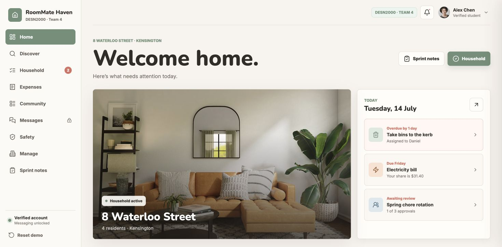

**Observed evidence**

- Primary buttons use `#ffffff` on `#6f8f78`, approximately `3.57:1`.
- Small sage text on pale sage surfaces is approximately `3.20:1`.
- The inspected primary-button text was `12.8px`; the eyebrow label was approximately `11px`.
- These small text combinations do not reach the WCAG AA `4.5:1` threshold.

**Impact**

Users with low vision or reduced contrast sensitivity may struggle to read important actions and statuses.

**Suggested fix**

Darken the sage foreground/background combinations or use dark text on pale surfaces; recheck all small coral and amber status text as part of the same contrast pass.

**Related source**

- [`app.css`](../../roommate-haven/app.css#L1)
- [`app.css`](../../roommate-haven/app.css#L140)

---

## QA-15 — “Export” button has no effect

**Category:** Functional  
**Priority:** P2

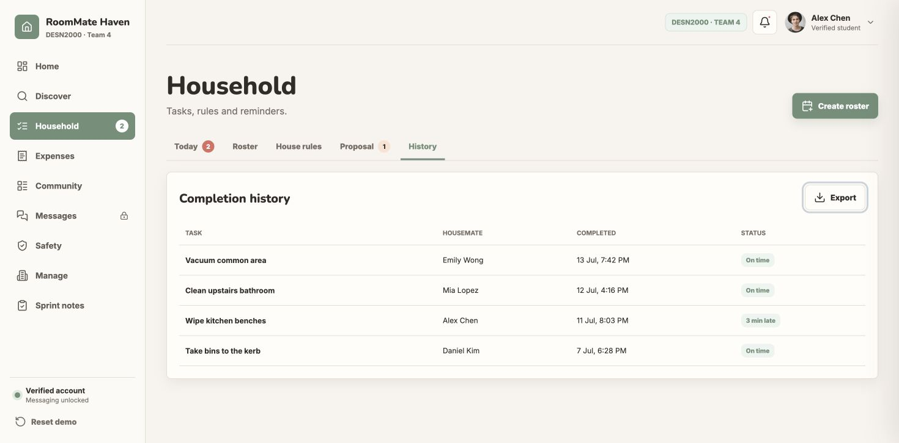

**Reproduction**

1. Open Household → History.
2. Focus “Export”.
3. Press `Enter`.

**Observed evidence**

- No download started.
- No downloadable link was created.
- The page and history table remained unchanged.

**Impact**

Users cannot export the completion history despite the visible control.

**Suggested fix**

Generate a CSV/PDF download or clearly mark the control as unavailable.

**Related source**

- [`index.html`](../../roommate-haven/index.html#L320)

---

## QA-16 — “Edit profile” button has no effect

**Category:** Functional  
**Priority:** P2

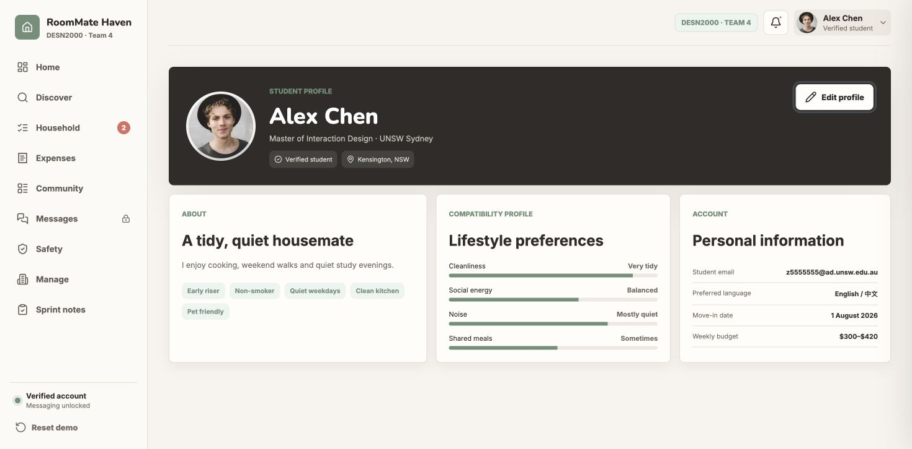

**Reproduction**

1. Open the profile page.
2. Focus “Edit profile”.
3. Press `Enter`.

**Observed evidence**

- No edit form or modal opened.
- The page remained `#profile`.
- The button retained focus with no success or unavailable-state feedback.

**Impact**

Users cannot update the profile information presented by the application.

**Suggested fix**

Open an editable profile form, or remove/disable the action until editing is supported.

**Related source**

- [`index.html`](../../roommate-haven/index.html#L593)

---

## QA-17 — Rent-record action has no effect

**Category:** Functional  
**Priority:** P2

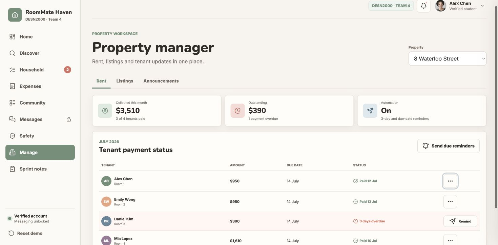

**Reproduction**

1. Open Manage → Rent.
2. Focus “Open Alex rent record”.
3. Press `Enter`.

**Observed evidence**

- No record, drawer or modal opened.
- The page remained `#manage/rent`.
- Only the icon button’s focus state changed.

**Impact**

Property managers cannot inspect tenant payment records advertised by the action buttons.

**Suggested fix**

Open a tenant rent-detail surface, or remove the inactive icon actions.

**Related source**

- [`index.html`](../../roommate-haven/index.html#L490)

---

## QA-18 — Announcement “View details” has no effect

**Category:** Functional  
**Priority:** P2

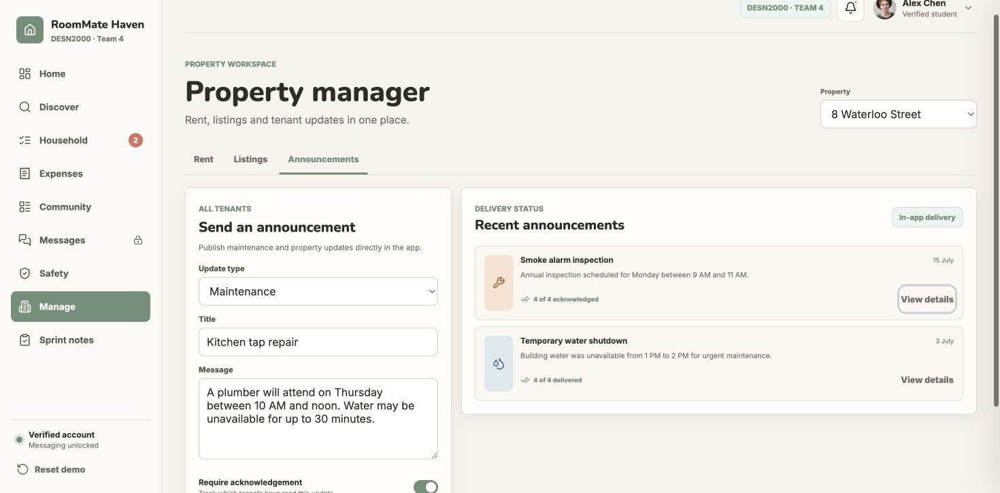

**Reproduction**

1. Open Manage → Announcements.
2. Focus “View details” for “Smoke alarm inspection”.
3. Press `Enter`.

**Observed evidence**

- No details panel or acknowledgement list opened.
- The page remained `#manage/announcements`.
- Only the button focus state changed.

**Impact**

Managers cannot inspect delivery or acknowledgement information implied by the control.

**Suggested fix**

Implement an announcement-detail view, or remove the inactive buttons.

**Related source**

- [`index.html`](../../roommate-haven/index.html#L539)

---

## Recommended implementation order

1. Fix the Playwright port mismatch so regression testing works reliably.
2. Restore mobile conversation switching and implement/remove misleading primary actions.
3. Add modal and notification-drawer focus management.
4. Fix validation/live-region announcements and tab semantics.
5. Correct language metadata, mobile navigation discoverability and colour contrast.

