# RoomMate Haven Sprint 2 修复验证

- 项目：`roommate-haven`
- 分支：`sprint2`
- 验证方式：Playwright 桌面视口 `1440 × 1000`、移动视口 `390 × 844`
- 自动化结果：Node 单元测试 `7/7` 通过；Playwright 回归覆盖功能、键盘可访问性和响应式布局
- 截图说明：以下每张截图均由 `e2e/capture-sprint2.cjs` 在断言通过后生成。

## FIX-01 — Playwright 与开发服务器端口一致

`playwright.config.cjs` 现在通过 `PORT=4173 npm start` 启动应用，与 `baseURL` 和健康检查 URL 完全一致。截图是 Playwright 成功访问 4173 端口后加载的首页。

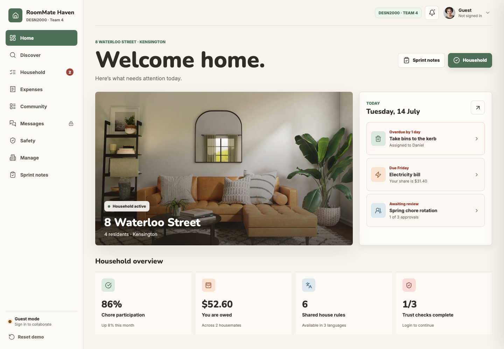

## FIX-02 — 模态框焦点不会逃到背景页面

打开登录模态框后，`Tab` 与 `Shift+Tab` 会在对话框的可聚焦控件之间循环。截图中的紫色焦点框位于模态框内部，自动化断言同时确认活动焦点属于 `#login-modal`。

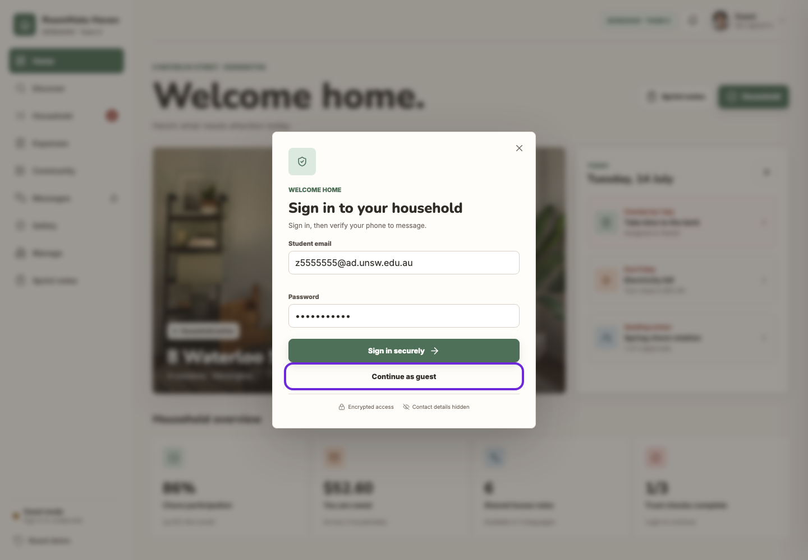

## FIX-03 — Escape 可以关闭模态框

按下 `Escape` 后，活动模态框被关闭，页面滚动与触发器焦点恢复。截图显示登录模态框已完全消失、首页重新可操作。

## FIX-04 — Skip link 真正移动焦点

激活 “Skip to content” 后，URL 更新到 `#main-content`，键盘焦点移动到主内容容器。截图中的紫色边框标识当前被聚焦的主内容区域。

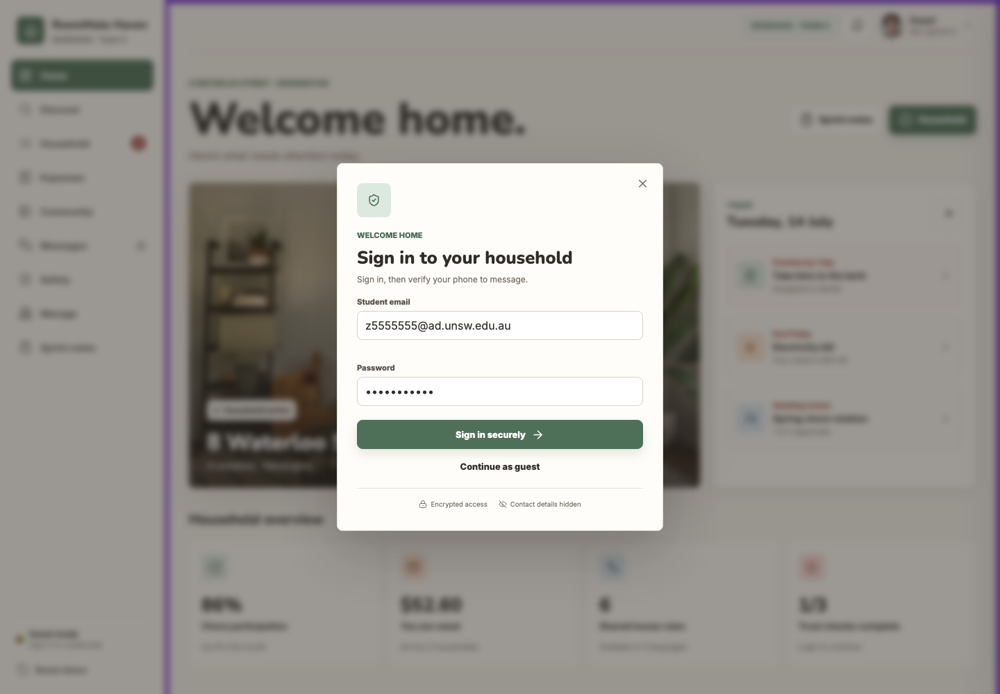

## FIX-05 — 通知抽屉具备正确焦点与背景隔离

通知抽屉现在使用模态对话框语义；打开时焦点进入关闭按钮，主应用和移动导航被设为 `inert`，`Escape` 关闭后焦点返回原触发器。截图显示打开的抽屉及其焦点状态。

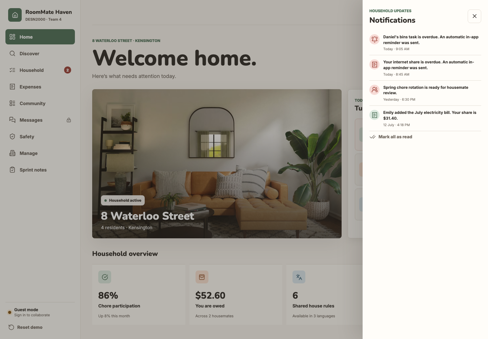

## FIX-06 — 消息安全警告可被辅助技术立即播报

联系方式被拦截时，警告使用 `role="alert"` 与 `aria-live="assertive"`，消息输入框通过 `aria-describedby` 关联警告。截图显示电话号码未发送且警告清晰可见。

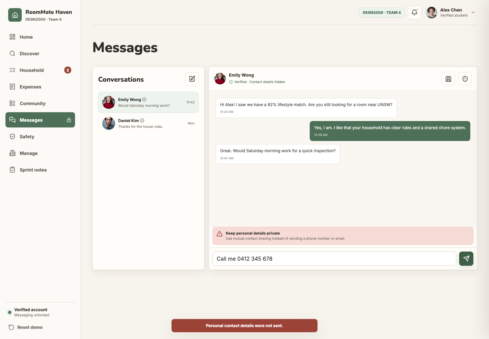

## FIX-07 — New message 不再是无响应按钮

点击 “New message” 会打开收件人选择对话框；用户可选择已验证成员并进入对应会话。截图显示可操作的新消息模态框。

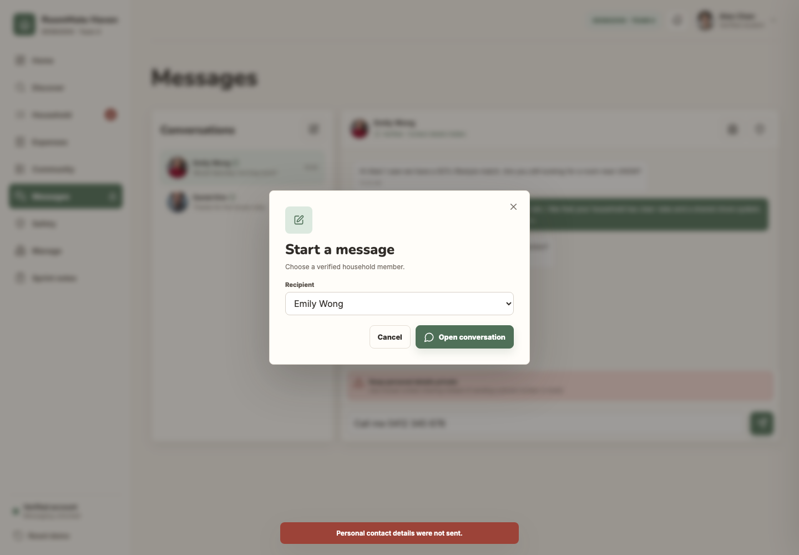

## FIX-08 — 移动端可以切换会话

在 `390px` 视口下新增会话选择器。截图显示已从 Emily 切换到 Daniel Kim，并保留消息输入与安全操作。

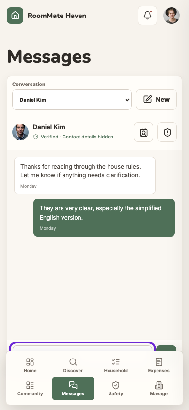

## FIX-09 — 移动导航不再横向溢出

移动导航改为 `4 × 2` 网格，八个主要目的地均位于 `390px` 可视范围内。Playwright 逐个检查按钮矩形未超出导航边界。

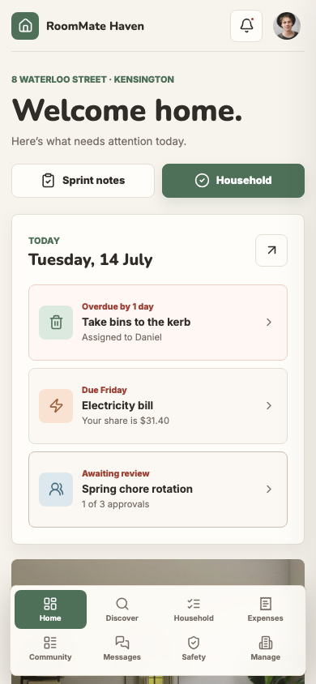

## FIX-10 — Save draft 提供明确结果

“Save draft” 现在保存当前 listing 字段到会话状态，并更新 `role="status"` 文本。截图同时显示 “Draft saved just now” 和成功提示。

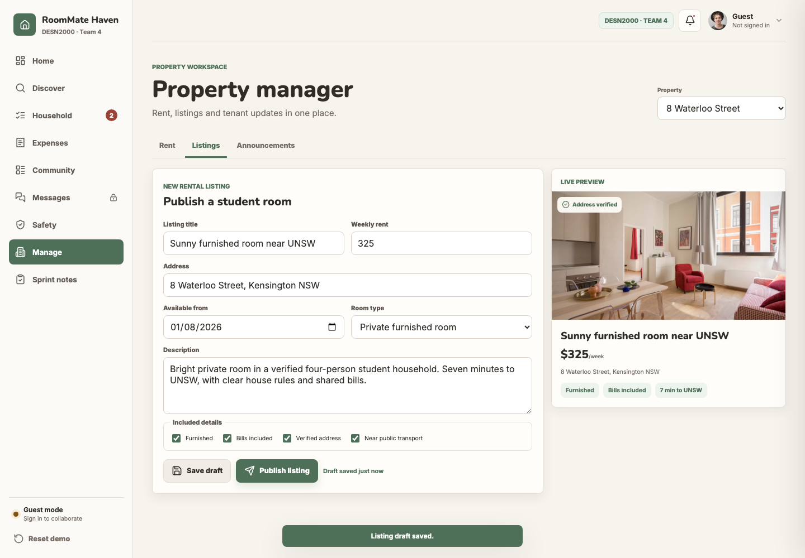

## FIX-11 — 标签页支持完整 ARIA 与键盘操作

Household 与 Manage 标签页现在包含 `tablist`、`tab`、`tabpanel`、`aria-selected` 和 `aria-controls` 关系，并支持左右方向键、Home、End。截图显示方向键移动到并激活 Proposal 标签。

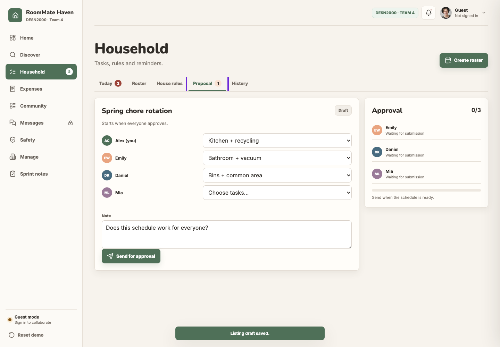

## FIX-12 — 中文内容具有正确语言标记

切换到简体中文后，规则列表同步设置 `lang="zh-CN"`，帮助屏幕阅读器使用正确的发音规则。截图显示已切换的中文家庭规则。

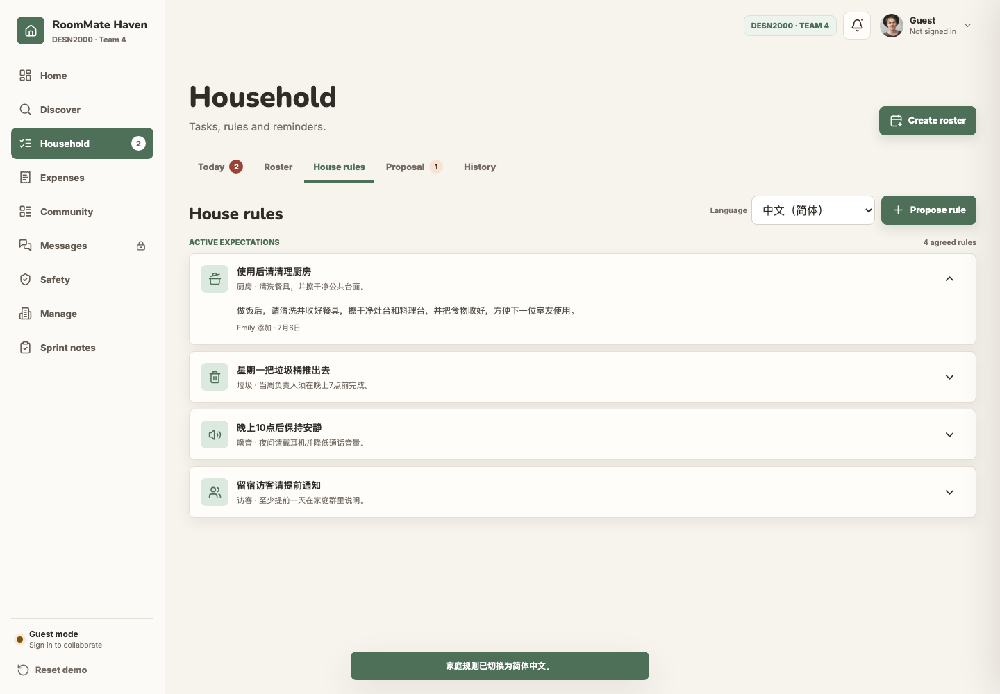

## FIX-13 — Roster 错误与字段关联并自动聚焦

提交缺少 Mia 任务的 roster 时，选择框获得 `aria-invalid="true"`，通过 `aria-describedby` 关联字段错误，并成为首个焦点。截图中的紫色焦点框和红色错误文本展示修复结果。

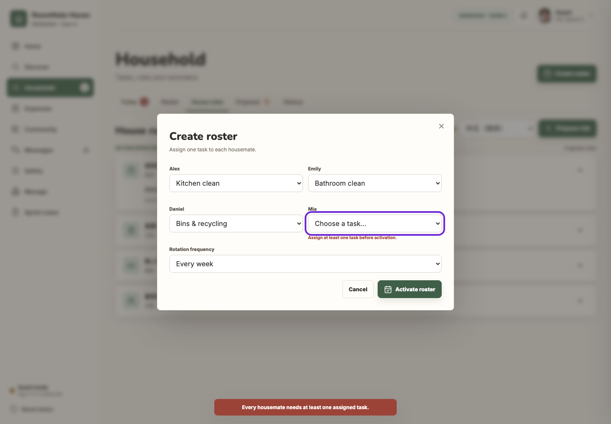

## FIX-14 — 状态色达到 WCAG AA 对比度

深色状态前景色已调整。自动计算结果为：sage/pale `4.95:1`、coral/soft `4.91:1`、blue/soft `4.56:1`、amber/soft `5.59:1`，均达到普通文本 `4.5:1` 要求。截图展示更新后的首页状态色。

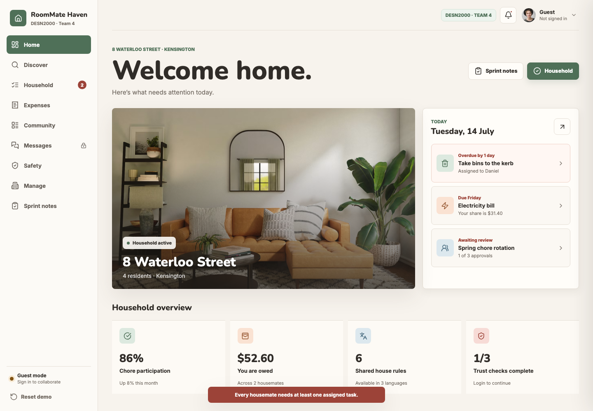

## FIX-15 — Export 生成 CSV 下载

History 页的 Export 现在生成 `roommate-haven-completion-history.csv`，内容包含任务、室友、完成时间与状态。Playwright 捕获并验证下载文件名；截图显示导出成功提示。

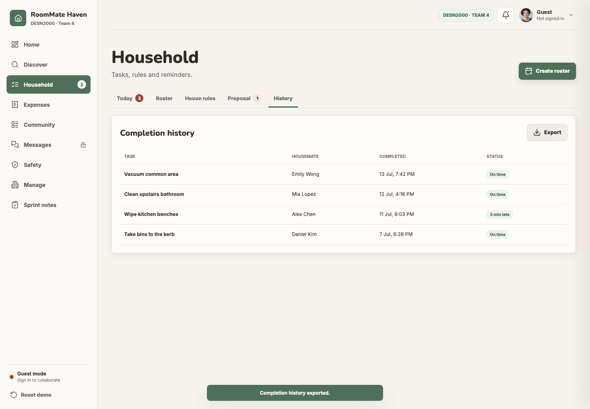

## FIX-16 — Edit profile 可以保存修改

Edit profile 会打开编辑表单；提交后 About 与 Weekly budget 立即更新到 Profile 页面。截图显示保存后的自我介绍和 `$330–$410` 预算。

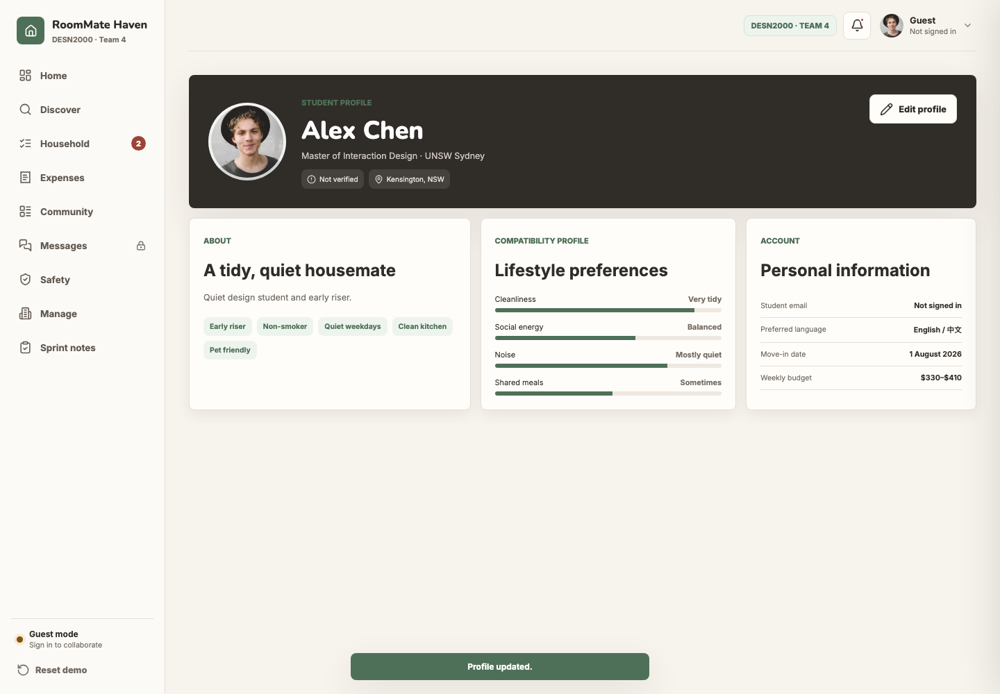

## FIX-17 — Rent record 打开对应租客记录

租金表格中的 “View record” 现在打开对应租客的记录对话框。截图显示 Alex Chen 的房间、金额、付款状态和摘要。

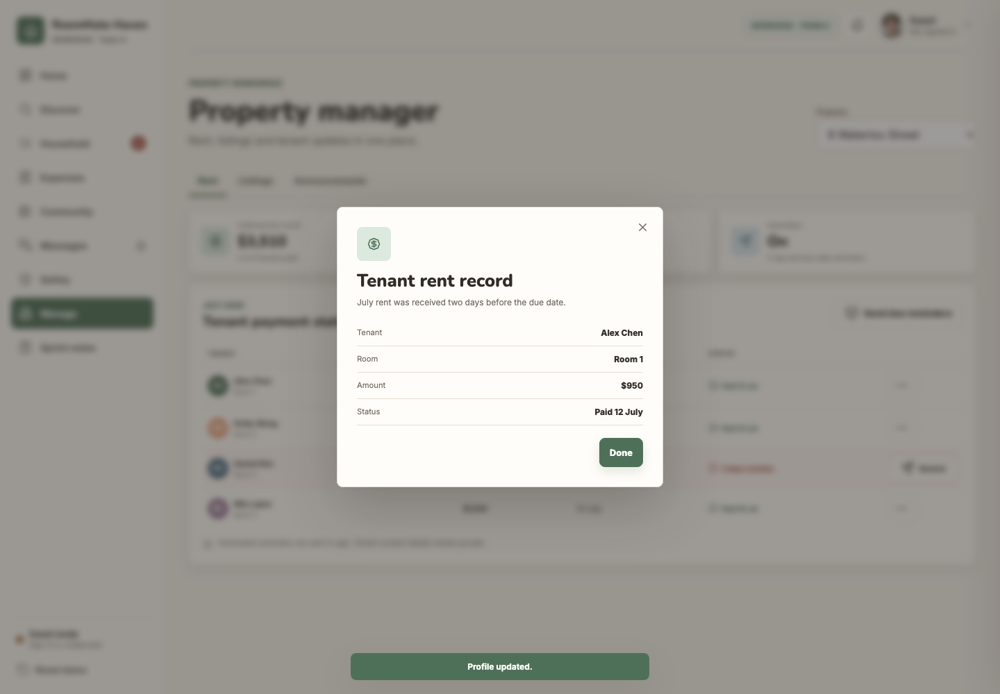

## FIX-18 — Announcement details 显示正文与送达状态

“View details” 现在打开公告详情对话框，包含原始正文、确认人数和安全送达说明。截图显示 Smoke alarm inspection 的完整详情。

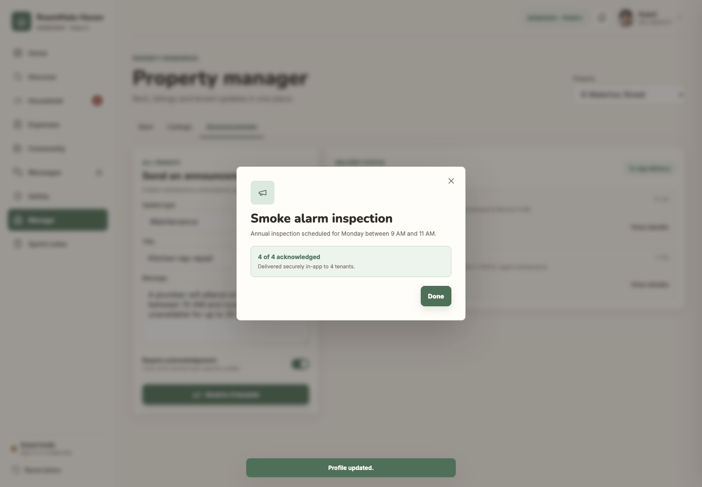

